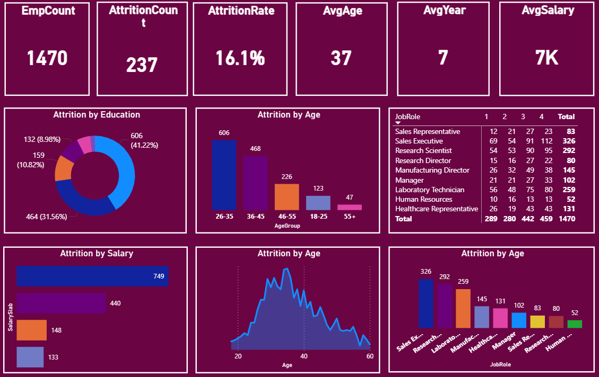

# HR Analytics – Employee Attrition Dashboard

## 📊 Project Overview
This project is an interactive HR Analytics Dashboard developed using Power BI to analyze employee attrition patterns and workforce insights.

The dashboard helps HR teams identify key factors influencing employee turnover and supports data-driven retention strategies.

---

## 🎯 Business Problem
Organizations often struggle to understand why employees leave. This dashboard analyzes attrition trends based on age, job role, salary, and education to uncover high-risk employee segments.

---

## 📈 Key KPIs
- Total Employees: 1470
- Attrition Count: 237
- Attrition Rate: 16.1%
- Average Age: 37
- Average Years at Company: 7
- Average Salary: 7K

---

## 🔍 Key Insights
- Highest attrition observed in age group 26–35
- Sales Executives and Research Scientists show higher turnover
- Lower salary bands experience higher attrition
- Majority attrition among Bachelor's degree holders

---

## 🛠 Tools & Technologies Used
- Power BI
- Power Query
- DAX
- Data Modeling
- Data Visualization

---

## 📌 Features
- Interactive slicers and filters
- Dynamic KPI calculations using DAX
- Attrition analysis by Age, Salary, Education, and Job Role
- Business-focused insights

---

## 🚀 Business Impact
The dashboard enables HR teams to identify high-risk attrition segments and develop targeted retention strategies.

## 📷 Dashboard Preview

